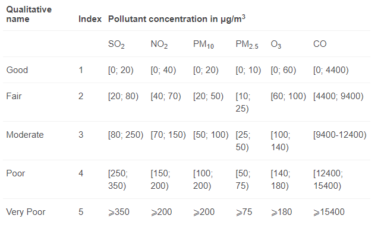

# Air Pollution Dashboard Project
The main goal is to familiarize myself with Azure and its services. To do this, I am using OpenWeather API ([OpenWeather main site](https://openweathermap.org/)). Using free API tier, I am pulling air pollution data for 100 biggest European cities according to [City Mayors website](http://www.citymayors.com/features/euro_cities1.html). This is done with databricks notebook in Azure. After gathering the data, the notebook transforms it from binary json, to csv format with only useful information left. Finally, the data is used in Power BI to create a simple dashboard (just for importing data from Azure).

## Project walkthrough
There are a couple of accounts needed for this project.

### OpenWeather API ([link](https://openweathermap.org/))
With a free tier, you can pull up to 60 rows per minute (1000 rows per day). This part of the project is free forever.

### Azure
This is the main part of the project. Here, I made a blob storage account to gather my data, and then set up a databricks notebook to write my code. After linking the right container with the notebook (the code is not in the notebook, it only needs to be done once), I transformed the data, to be in a flat file, append the newly gathered data to previously stored data, and saved it in the blob storage again. The notebook has been scheduled to run every 8 hours (0:00, 8:00, 16:00).

Code used for connecting (keys are not visible for safety reasons):
~~~
dbutils.fs.mount(
  source = f"wasbs://air-polution-data@airpolution.blob.core.windows.net/data",
  mount_point = "/mnt/airpollution",
  extra_configs = {"fs.azure.sas.air-polution-data.airpolution.blob.core.windows.net":"SAS_KEY"}
)
~~~

This part of the project is free, but only for a limited time. Azure offers a free trial account with $200 to use in 30 days.

A local script has also been developed (see: local_notebook.ipynb).

### Power BI
Finally, the data gathered in blob storage was used in Power BI to create a simple dashboard. Since I do not have the premium version, the dashboard does not update automatically but assuming it is published, it will continue to use the newest data available.

The data was pulled from the Azure storage service, and slightly transformed for the analysis purposes. 3 classes were created based on the time of measuring air pollution: night (0:00), morning (8:00), and afternoon (16:00). On top of that a score system provided by OpenWeather was implemented to further investigate the air quality.

The scores were summed up to create one number representing the overall quality of air.